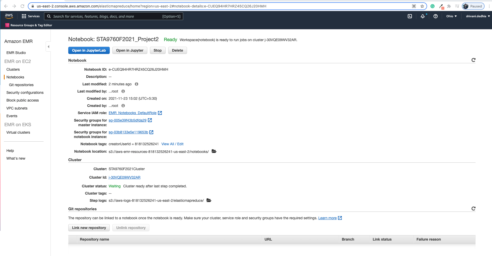
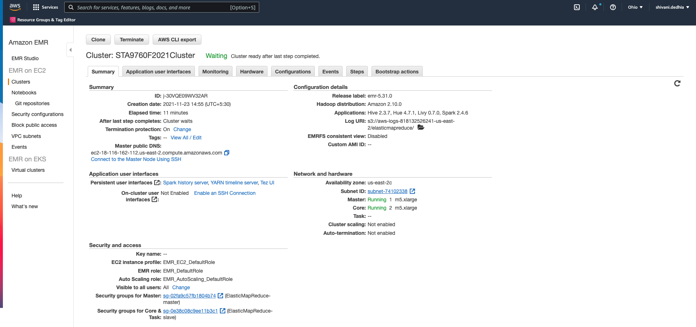

# Analyzing 10Gb of Yelp Reviews Data

Analyzed a subset of Yelp's business, reviews and user data. This dataset comes to us from [Kaggle](https://www.kaggle.com/yelp-dataset/yelp-dataset) although we have taken steps to pull this data into a s3 bucket: `s3://sta9760-yelpdataset/yelp-light/*business.json`

## Technology Used

**Create a Cluster on AWS EMR**  
  * Provision the hardware  
  * Configure Jupyter Notebook connected to the cluster
  
**Run Spark Cluster Tasks via Jupyter Notebook** 

**Read the dataset through S3 Buckets**

## Analysis
  Part I: Installation and Initial Setup   
  
  Part II: Analyzing Categories (Business dataset)    
  
  Part III:  Do Yelp Reviews biased from the average rating? (Review dataset)  
  
  Part IV: Analzing Users (User dataset)

## Cluster and Notebook Configs

